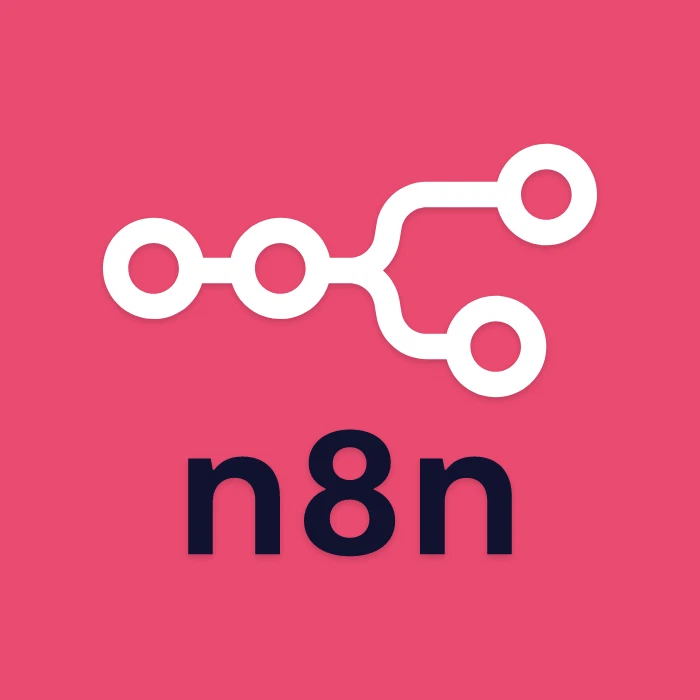

<p align="center" style="margin: 10px;">
    
</p>

<div align="center">

# n8n Instagram Reel AI Extractor


**A fully self-hosted, agentic AI pipeline built with n8n that scrapes Instagram Reels, transcribes audio via Whisper, extracts and categorises structured data using an LLM, and stores results in Google Sheets — all orchestrated with Docker.**

</div>

---

## 💼 What This Demonstrates

This project showcases real-world n8n automation skills applicable across industries:

- **End-to-end workflow design** — form trigger → scrape → transcribe → AI extract → store
- **AI integration** — prompt engineering with GPT-4.1-mini for structured JSON output
- **Self-hosted microservices** — containerised Flask APIs for scraping and transcription
- **Third-party API integration** — Google Sheets as both trigger source and data store
- **Docker orchestration** — multi-container setup with Nginx reverse proxy

> 🔧 **This workflow is adaptable** — the same architecture can be applied to TikTok, YouTube Shorts, or any content source, and the output can target Notion, Airtable, Slack, or any database.

---

## 🚀 Business Use Cases

This tool's architecture delivers real value across a range of industries:

### 📊 Digital Research & Market Intelligence
Automatically ingest social media content on any topic — market trends, competitor activity, product launches — and get a structured, categorised database in seconds. No more manual video watching.

### 📈 Sentiment & Trend Analysis
Layer in comment scraping and engagement metrics to track real-time sentiment around your brand, product, or campaign. Monitor competitor profiles for spikes in positive or negative feedback.

### 🛡️ Risk Detection & Cyber Intelligence
Scan social platforms for brand mentions, disinformation, or threat signals at scale — something impossible for human teams alone. AI flags, categorises, and routes alerts automatically.

### 🏪 Small Business Monitoring
Give small businesses an affordable way to track their digital footprint — see what customers are saying, spot recurring complaints, and respond faster without agency fees.

---

## ⚙️ Tech Stack

| Tool | Role |
|---|---|
| **n8n** | Low-code workflow orchestrator — the core of the pipeline |
| **Instaloader** | Python library (served via Flask) for scraping Reels |
| **OpenAI Whisper (faster-whisper)** | Local audio-to-text transcription, served via Flask |
| **GPT-4.1-mini** | LLM for information extraction and categorisation |
| **Docker & Docker Compose** | Containerised deployment — portable and reproducible |
| **Google Sheets API** | Data storage and polling trigger source |
| **Nginx Proxy Manager** | Reverse proxy for secure external routing |

---

## 🔄 Workflow Overview

<p align="center"></p>

### 1. Submit Reel URL
A Google Form collects Reel links into a "Form Responses" sheet. n8n polls it every 5 minutes — a "Scraped" column prevents duplicate processing.

<p align="center"></p>

### 2. Scrape the Reel
Instaloader downloads the video and description to local storage. This microservice is containerised and served via Flask for modularity and reusability across workflows.

### 3. Transcribe Audio (Optional)
If the user ticked "Scrape Audio?" in the form, the video is transcribed using `faster-whisper` — a local, CPU-capable model with strong accuracy for spoken content.

<p align="center"></p>

### 4. AI Information Extraction
The scraped description and transcript are passed to GPT-4.1-mini with a structured prompt that:
- Identifies each distinct actionable item
- Assigns it to exactly one category: `Food & Drink`, `Accommodations`, `Activities & Attractions`, or `Info & Other`
- Returns valid JSON matching a defined schema

<p align="center"></p>

<details>
<summary>📋 View System Prompt</summary>

```
You are an expert at reading social-media content and extracting structured data.

• Identify every distinct piece of actionable information in the description and transcript
  (e.g., a hotel mention, a restaurant, a safety tip) and output each as a separate items[] entry.
• Assign each entry exactly one category: "Food & Drink", "Accommodations",
  "Activities & Attractions", or "Info & Other".
• Categories:
  - Food & Drink: ONLY specific locations to eat/drink e.g. "Sam's Beach Bar". Type: Restaurant, Cafe, etc.
  - Accommodations: Places to stay — Hotels, Hostels, etc.
  - Activities & Attractions: Things to do — Bars, Beaches, Clubs, Snorkelling, etc.
  - Info & Other: Tips, tricks, or general information.
• Use the full context of description + transcript when categorising.
• Include a notes field per item — as detailed as needed.
• Do not invent extra keys or categories.
• Return ONLY valid JSON matching the schema.
```

</details>

### 5. Save to Google Sheets
n8n loops over each extracted JSON item and routes it via a Switch node to the correct Google Sheets tab. A Wait node handles API rate limits gracefully.

<p align="center"></p>
<p align="center"></p>

---

## 🛠️ Setup & Deployment

### Prerequisites
- Docker & Docker Compose installed
- A Google Cloud project with Sheets API enabled
- An OpenAI API key

### Quick Start

```bash
# 1. Clone the repo
git clone https://github.com/chiransh/n8n-instagram-ai-pipeline.git
cd n8n-instagram-ai-pipeline

# 2. Configure environment variables
cp .env.example .env
# Fill in: OPENAI_API_KEY, Google credentials, n8n tunnel settings

# 3. Start all services
docker-compose up -d

# 4. Open n8n and import the workflow
# Navigate to http://localhost:5678
# Import src/workflow.json
```

### Services Started
| Service | Port | Description |
|---|---|---|
| n8n | 5678 | Workflow UI |
| Instaloader API | 5001 | Reel scraper |
| Whisper API | 5002 | Audio transcription |

---

## 📊 Results & Observations

Processing ~20 reels cost approximately **$0.02** using GPT-4.1-mini. The LLM performed well at information extraction and contextual categorisation. Areas for improvement with more prompt engineering: filtering out advertisement content, and tightening edge-case category assignment (e.g. food hygiene tips vs. food locations).

The built-up database enables trend spotting — frequently mentioned places surface quickly, which is especially useful for popularity analysis.

---

## 🧠 Technical Notes

**Self-hosted vs Cloud LLMs:** GPT-4.1-nano struggled with categorisation accuracy; GPT-4.1-mini gave the best cost/accuracy balance. Self-hosted models (TinyLlama, Llama 3.1 4B) were tested — Llama 3.1 worked on GPU but was too slow on CPU for production use, and both struggled with strict JSON schema adherence.

**Self-hosting rationale:** Chosen for cost efficiency, deeper DevOps learning (networking, reverse proxy config), and data privacy — a setup that scales naturally to more sensitive workflows.

---

## 📁 Project Structure

```
├── src/
│   ├── workflow.json          # n8n workflow export
│   ├── scraper/               # Instaloader Flask service
│   └── transcriber/           # Whisper Flask service
├── docs/                      # Screenshots and demo assets
├── docker-compose.yml
└── README.md
```

---

## Contents

- [What This Demonstrates](#-what-this-demonstrates)
- [Business Use Cases](#-business-use-cases)
- [Tech Stack](#️-tech-stack)
- [Workflow Overview](#-workflow-overview)
- [Setup & Deployment](#️-setup--deployment)
- [Results & Observations](#-results--observations)
- [Technical Notes](#-technical-notes)